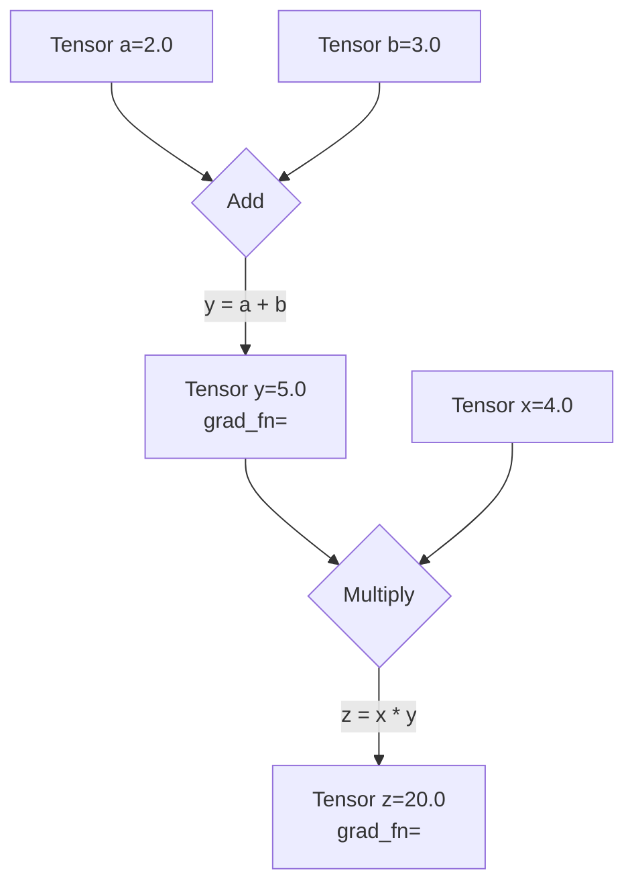

# **Give Me 1 Hour, You Will Build and Train a Neural Network From Scratch**

**Original source:** 

**- [PyTorch in 1 Hour](https://youtu.be/r1bquDz5GGA?si=QZ0slG57KcKimf0R)**

**- [Github Repo](https://github.com/The-Pocket/PocketFlow-Tutorial-Video-Generator/blob/main/docs/llm/pytorch.md)**

## Intro

You've seen PyTorch code. Maybe in a research paper or a tutorial. You saw `model.train()`, `loss.backward()`, and `optimizer.step()`.

You wondered what they actually *do*.

Maybe you tried to read the documentation. Got hit with a wall of classes. `nn.Module`, `torch.optim`, computation graphs. It felt like opaque, magical black boxes.

**Here's the truth: They're not black boxes. They are elegant wrappers for the linear algebra and calculus you already know.**

The entire deep learning training process, from the simplest model to a giant LLM, is just a five-step algorithm. That's it. Everything else is just an implementation detail.

- The `nn.Linear` layer? It's just `X @ W + b`.
- The loss function? Just a formula to measure error, like `torch.mean((y - y_hat)**2)`.
- The magical `loss.backward()`? It's just your old friend, the chain rule (backpropagation), automated.
- The `optimizer.step()`? It's just the gradient descent update rule: `W -= learning_rate * W.grad`.

**In this guide, we'll implement the raw math first, then use PyTorch's professional tools.**

You'll see *why* the tools exist by first doing the work manually. Once you've implemented the raw math, the professional code becomes obvious—just a clean, powerful way to organize what you've already built.

**And it all boils down to these 5 steps.**

Master this five-step loop, and you can understand the training code for any model, from a simple regression to a state-of-the-art Large Language Model.

| Step                        | Concept (Math)                                                | From Scratch (Raw Tensors)            | Professional (`torch.nn`)    |
| :-------------------------- | :------------------------------------------------------------ | :------------------------------------ | :----------------------------- |
| **1. Prediction**     | Make a prediction:`<br>` `ŷ = f(X, θ)`                  | `y_hat = X @ W + b`                 | `y_hat = model(X)`           |
| **2. Loss Calc**      | Quantify the error:`<br>` `L = Loss(ŷ, y)`               | `loss = torch.mean((y_hat - y)**2)` | `loss = criterion(y_hat, y)` |
| **3. Gradient Calc**  | Find the slope of the loss:`<br>` `∇_θ L`               | `loss.backward()`                   | `loss.backward()`            |
| **4. Param Update**   | Step down the slope:`<br>` `θ_t+1 = θ_t - η * ∇_θ L` | `W -= lr * W.grad`                  | `optimizer.step()`           |
| **5. Gradient Reset** | Reset for the next loop.                                      | `W.grad.zero_()`                    | `optimizer.zero_grad()`      |

Even better—this loop is universal. The `model` in Step 1 might become a massive Transformer, and the `optimizer` in Step 4 might be a fancy one like Adam, but the fundamental five-step logic **never changes**.

This isn't an analogy. The `nn.Linear` layer used in LLMs is the *exact same* `X @ W + b` operation you will build in Part 2. The Feed-Forward Network inside a Transformer is the *exact same* stack of layers you will build in Part 4. You are learning the literal, fundamental building blocks of modern AI.

Give me one hour. We'll build your understanding from the ground up. Raw math, real code, and a clear path to the professional tools.

Ready? Let's begin.

## Part 1: The Core Data Structure - `torch.Tensor`

Welcome to PyTorch! Everything we do—from loading data to defining complex neural networks—will be built on one core object: the `torch.Tensor`.

**The Analogy:** Think of a `Tensor` as the fundamental building block, the basic "noun" of the PyTorch language. It's a multi-dimensional array, very similar to a NumPy array, but with special powers for deep learning that we will unlock step-by-step.

Our goal in this section is to master this single, crucial object: how to create it and how to understand its properties.

### 1.1. The Three Common Patterns for Creating Tensors

There are many ways to create a tensor, but they generally fall into three common patterns you'll see everywhere.

#### **Pattern 1: Direct Creation from Existing Data**

This is the most straightforward. You have a Python list of numbers, and you want to convert it into a PyTorch tensor using `torch.tensor()`.

```python
import torch

# Input: A standard Python list
data = [[1, 2, 3], [4, 5, 6]]
my_tensor = torch.tensor(data)

print(my_tensor)
```

**Output:**

```
tensor([[1, 2, 3],
        [4, 5, 6]])
```

---

#### **Pattern 2: Creation from a Desired Shape**

This is extremely common when building models. You don't know the exact values for your weights yet, but you know the dimensions (shape) you need.

* `torch.ones()` or `torch.zeros()`: Fills the tensor with `1`s or `0`s.
* `torch.randn()`: Fills the tensor with random numbers from a standard normal distribution. **This is the standard way to initialize a model's weights.**

```python
# Input: A shape tuple (2 rows, 3 columns)
shape = (2, 3)

# Create tensors with this shape
ones = torch.ones(shape)
zeros = torch.zeros(shape)
random = torch.randn(shape)

print(f"Ones Tensor:\n {ones}\n")
print(f"Zeros Tensor:\n {zeros}\n")
print(f"Random Tensor:\n {random}")
```

**Output:**

```
Ones Tensor:
 tensor([[1., 1., 1.],
        [1., 1., 1.]])

Zeros Tensor:
 tensor([[0., 0., 0.],
        [0., 0., 0.]])

Random Tensor:
 tensor([[ 0.3815, -0.9388,  1.6793],
        [-0.3421,  0.5898,  0.3609]])
```

---

#### **Pattern 3: Creation by Mimicking Another Tensor's Properties**

Often, you have an existing tensor and you need to create a new one that has the *exact same shape, data type, and is on the same device*. Instead of manually copying these properties, PyTorch provides handy `_like` functions.

```python
# Input: A 'template' tensor
template = torch.tensor([[1, 2], [3, 4]])

# Create new tensors with the same properties as the template
ones_like = torch.ones_like(template)
rand_like = torch.randn_like(template, dtype=torch.float) # dtype can be overridden

print(f"Template Tensor:\n {template}\n")
print(f"Ones_like Tensor:\n {ones_like}\n")
print(f"Randn_like Tensor:\n {rand_like}")
```

**Output:**

```
Template Tensor:
 tensor([[1, 2],
        [3, 4]])

Ones_like Tensor:
 tensor([[1, 1],
        [1, 1]])

Randn_like Tensor:
 tensor([[-1.1713, -0.2032],
        [ 0.3391, -0.8267]])
```

### 1.2. What's Inside a Tensor? Shape, Type, and Device

Every tensor has attributes that describe its metadata. The three you will use constantly are `.shape`, `.dtype`, and `.device`.

```python
# Let's create a tensor to inspect
tensor = torch.randn(2, 3)

print(f"Shape of tensor: {tensor.shape}")
print(f"Datatype of tensor: {tensor.dtype}")
print(f"Device tensor is stored on: {tensor.device}")
```

**Output:**

```
Shape of tensor: torch.Size([2, 3])
Datatype of tensor: torch.float32
Device tensor is stored on: cpu
```

Let's break these down:

* **`.shape`**: This is a tuple that describes the dimensions of the tensor. `torch.Size([2, 3])` tells us it's a 2D tensor with 2 rows and 3 columns. This is the most important attribute for debugging your models. Mismatched shapes are the #1 source of errors in PyTorch.
* **`.device`**: This tells you where the tensor's data is physically stored. By default, it's on the `cpu`. If you have a compatible GPU, you can move it there (`.to("cuda")`) for massive speedups.
* **`.dtype`**: This describes the data type of the numbers inside the tensor. Notice it defaulted to `torch.float32`. This is not an accident, and it's critically important.

#### A Quick but Critical Note on `dtype`

Why `torch.float32` and not just regular integers (`int64`)? The answer is **gradients**.

Gradient descent, the engine of deep learning, works by making tiny, continuous adjustments to a model's weights. These adjustments are fractional numbers (like `-0.0012`), which require a floating-point data type. You can't nudge a parameter from `3` to `3.001` if your data type only allows whole numbers.

**Key Takeaway:**

* Model parameters (weights and biases) **must** be a float type (`float32` is the standard).
* Data that represents categories or counts (like word IDs) can be integers (`int64`).

---

We now know what a `torch.Tensor` is and how to create one using three common patterns. We've essentially learned about the raw material.

Now, let's explore the single most important switch that turns this simple data container into a core component of a dynamic learning machine. Let's move on to **Part 2: The Engine of Autograd**.

## Part 2: The Engine of Autograd - `requires_grad`

In Part 1, we learned that tensors are containers for numbers. But their real power comes from a system called **Autograd**, which stands for automatic differentiation. This is PyTorch's built-in gradient calculator.

**The Analogy:** If a tensor is the "noun" in PyTorch, then Autograd is the "nervous system." It connects all the operations and allows signals (gradients) to flow backward through the system, enabling learning.

Our goal here is to understand the *one simple switch* that activates this nervous system.

### 2.1. The "Magic Switch": `requires_grad=True`

By default, PyTorch assumes a tensor is just static data. To tell it that a tensor is a learnable parameter (like a model's weight or bias), you must set its `requires_grad` attribute to `True`.

This is the most important setting in all of PyTorch. It tells Autograd:

> "This is a parameter my model will learn. From now on, track every single operation that happens to it."

```python
# A standard data tensor (we don't need to calculate gradients for our input data)
x_data = torch.tensor([[1., 2.], [3., 4.]])
print(f"Data tensor requires_grad: {x_data.requires_grad}\n")

# A parameter tensor (we need to learn this, so we need gradients)
w = torch.tensor([[1.0], [2.0]], requires_grad=True)
print(f"Parameter tensor requires_grad: {w.requires_grad}")
```

**Output:**

```
Data tensor requires_grad: False

Parameter tensor requires_grad: True
```

### 2.2. The Computation Graph: How PyTorch Remembers

Once you set `requires_grad=True`, PyTorch starts building a **computation graph** behind the scenes. Think of it as a history of all the operations. Every time you perform an operation on a tensor that requires gradients, PyTorch adds a new node to this graph.

Let's build a simple one. We'll compute `z = x * y` where `y = a + b`.

```python
# Three parameter tensors that we want to learn
a = torch.tensor(2.0, requires_grad=True)
b = torch.tensor(3.0, requires_grad=True)
x = torch.tensor(4.0, requires_grad=True)

# First operation: y = a + b
y = a + b

# Second operation: z = x * y
z = x * y

print(f"Result of a + b: {y}")
print(f"Result of x * y: {z}")
```

**Output:**

```
Result of a + b: 5.0
Result of x * y: 20.0
```

The math is simple. But behind the scenes, PyTorch has built a graph connecting `a`, `b`, `x`, `y`, and `z`.

### 2.3. Peeking Under the Hood: The `.grad_fn` Attribute

How can we prove this graph exists? Every tensor that is the result of an operation on a `requires_grad` tensor will have a special attribute called `.grad_fn`. This attribute is a "breadcrumb" that points to the function that created it.

Let's inspect the tensors from our previous example.

```python
# z was created by multiplication
print(f"grad_fn for z: {z.grad_fn}")

# y was created by addition
print(f"grad_fn for y: {y.grad_fn}")

# a was created by the user, not by an operation, so it has no grad_fn
print(f"grad_fn for a: {a.grad_fn}")
```

**Output:**

```
grad_fn for z: <MulBackward0 object at 0x10f7d3d90>
grad_fn for y: <AddBackward0 object at 0x10f7d3d90>
grad_fn for a: None
```

This is the tangible proof of the computation graph. PyTorch knows `z` came from a multiplication (`MulBackward0`) and `y` came from an addition (`AddBackward0`). When we later ask it to compute gradients, it will use this information to trace its way backward through the graph using the chain rule.

### 2.4. Visualizing the Graph

Here is what the graph we just created looks like. The `grad_fn` is the "arrow" leading to each new tensor.



---

We have now learned how to activate PyTorch's "nervous system" by setting `requires_grad=True`. This allows PyTorch to build a computation graph and remember the history of all operations.

We have built the network of roads. In the next parts, we'll learn the common operations (the "verbs") and then see how to send the gradient signal flowing backward along these roads to enable learning. Let's move on to **Part 3: Basic Mathematical & Reduction Operations**.

## Part 3: Basic Mathematical & Reduction Operations

We have our `Tensor` (the noun) and `Autograd` (the nervous system). Now we need **operations** (the verbs) to describe the calculations our model will perform. In deep learning, the vast majority of these operations are surprisingly simple: matrix multiplications and aggregations.

Our goal is to master these core verbs and, most importantly, the critical `dim` argument that controls how they work.

### 3.1. Mathematical Operations: `*` vs. `@`

This is the single most common point of confusion for beginners. PyTorch has two very different kinds of multiplication.

**1. Element-wise Multiplication (`*`)**
This operation multiplies elements in the same position. It's like overlaying two tensors and multiplying the corresponding cells. The tensors **must have the same shape**.

```python
a = torch.tensor([[1, 2], [3, 4]])
b = torch.tensor([[10, 20], [30, 40]])

# Calculation: [[1*10, 2*20], [3*30, 4*40]]
element_wise_product = a * b

print(f"Tensor a:\n {a}\n")
print(f"Tensor b:\n {b}\n")
print(f"Element-wise Product (a * b):\n {element_wise_product}")
```

**Output:**

```
Tensor a:
 tensor([[1, 2],
        [3, 4]])

Tensor b:
 tensor([[10, 20],
        [30, 40]])

Element-wise Product (a * b):
 tensor([[ 10,  40],
        [ 90, 160]])
```

---

**2. Matrix Multiplication (`@`)**
This is the standard matrix product from linear algebra. It's the core operation of every `Linear` layer in a neural network. For `m1 @ m2`, the number of columns in `m1` must equal the number of rows in `m2`.

```python
m1 = torch.tensor([[1, 2, 3], [4, 5, 6]])   # Shape: (2, 3)
m2 = torch.tensor([[7, 8], [9, 10], [11, 12]]) # Shape: (3, 2)

# Calculation for the first element: (1*7) + (2*9) + (3*11) = 58
matrix_product = m1 @ m2 # Resulting shape: (2, 2)

print(f"Matrix 1 (shape {m1.shape}):\n {m1}\n")
print(f"Matrix 2 (shape {m2.shape}):\n {m2}\n")
print(f"Matrix Product (m1 @ m2):\n {matrix_product}")
```

**Output:**

```
Matrix 1 (shape torch.Size([2, 3])):
 tensor([[1, 2, 3],
        [4, 5, 6]])

Matrix 2 (shape torch.Size([3, 2])):
 tensor([[ 7,  8],
        [ 9, 10],
        [11, 12]])

Matrix Product (m1 @ m2):
 tensor([[ 58,  64],
        [139, 154]])
```

### 3.2. Reduction Operations

A "reduction" is any operation that reduces the number of elements in a tensor, often by aggregating them. Examples include `sum()`, `mean()`, `max()`, and `min()`.

```python
scores = torch.tensor([[10., 20., 30.], [5., 10., 15.]])

# By default, reductions apply to the entire tensor
total_sum = scores.sum()
average_score = scores.mean()

print(f"Scores Tensor:\n {scores}\n")
# Calculation: 10 + 20 + 30 + 5 + 10 + 15 = 90
print(f"Total Sum: {total_sum}")
# Calculation: 90 / 6 = 15
print(f"Overall Mean: {average_score}")
```

**Output:**

```
Scores Tensor:
 tensor([[10., 20., 30.],
        [ 5., 10., 15.]])

Total Sum: 90.0
Overall Mean: 15.0
```

### 3.3. The `dim` Argument: The Most Important Detail

This is where reductions become powerful. The `dim` argument tells the function which dimension to **collapse**.

A simple rule of thumb for 2D tensors:

* `dim=0`: Collapses the **rows** (operates "vertically" ⬇️).
* `dim=1`: Collapses the **columns** (operates "horizontally" ➡️).

Let's use our `scores` tensor (2 students, 3 assignments) to see this.

```python
scores = torch.tensor([[10., 20., 30.], [5., 10., 15.]])

# To get the sum FOR EACH ASSIGNMENT, we collapse the student dimension (dim=0)
# Calculation: [10+5, 20+10, 30+15]
sum_per_assignment = scores.sum(dim=0)

# To get the sum FOR EACH STUDENT, we collapse the assignment dimension (dim=1)
# Calculation: [10+20+30, 5+10+15]
sum_per_student = scores.sum(dim=1)

print(f"Original Scores:\n {scores}\n")
print(f"Sum per assignment (dim=0): {sum_per_assignment}")
print(f"Sum per student (dim=1):    {sum_per_student}")
```

**Output:**

```
Original Scores:
 tensor([[10., 20., 30.],
        [ 5., 10., 15.]])

Sum per assignment (dim=0): tensor([15., 30., 45.])
Sum per student (dim=1):    tensor([60., 30.])
```

This table visualizes exactly what happened:

| `scores`          | Assignment 1 | Assignment 2 | Assignment 3 | `sum(dim=1)` ➡️ |
| :------------------ | :----------: | :----------: | :----------: | :-----------------: |
| Student 1           |      10      |      20      |      30      |    **60**    |
| Student 2           |      5      |      10      |      15      |    **30**    |
| `sum(dim=0)` ⬇️ | **15** | **30** | **45** |                    |

Mastering the `dim` argument is essential for everything from calculating loss functions to implementing attention mechanisms.

---

We now have the basic vocabulary of calculation and aggregation. We know how to multiply matrices and how to sum up results across specific dimensions.

Now let's look at more advanced "verbs" for selecting and manipulating data. Let's move on to **Part 4: Advanced Indexing & Selection Primitives**.

## Part 4: Advanced Indexing & Selection Primitives

If basic math ops are the "verbs" of PyTorch, then indexing primitives are the "adverbs" and "prepositions"—they let you specify *which* data to act upon with great precision.

Our goal is to learn how to select data in increasingly sophisticated ways, moving from uniform block selection to dynamic, per-row lookups.

### 4.1. Standard Indexing: The Basics

This works just like in Python lists or NumPy. It's for selecting uniform "blocks" of data, like entire rows or columns.

```python
# A simple, easy-to-read tensor
x = torch.tensor([[0, 1, 2, 3],
                  [4, 5, 6, 7],
                  [8, 9, 10, 11]])

# Get the second row (at index 1)
row_1 = x[1]
print(f"Row 1: {row_1}\n")

# Get the third column (at index 2)
col_2 = x[:, 2]
print(f"Column 2: {col_2}\n")

# Get a specific element (row 1, column 3)
element_1_3 = x[1, 3]
print(f"Element at (1, 3): {element_1_3}")
```

**Output:**

```
Row 1: tensor([4, 5, 6, 7])

Column 2: tensor([ 2,  6, 10])

Element at (1, 3): 7
```

### 4.2. Boolean Masking: Selection by Condition

Instead of using integer indices, you can use a boolean (True/False) tensor to select only the elements where the mask is `True`.

```python
x = torch.tensor([[0, 1, 2, 3], [4, 5, 6, 7]])

# Step 1: Create the boolean mask
mask = x > 3
print(f"The Boolean Mask (x > 3):\n {mask}\n")

# Step 2: Apply the mask to the tensor
selected_elements = x[mask]
print(f"Selected elements: {selected_elements}")
```

**Output:**

```
The Boolean Mask (x > 3):
 tensor([[False, False, False, False],
        [ True,  True,  True,  True]])

Selected elements: tensor([4, 5, 6, 7])
```

**Note:** Boolean selection always returns a 1D tensor, as it pulls out only the matching values.

### 4.3. Conditional Creation: `torch.where()`

This is the tensor equivalent of a ternary `if/else` statement. It creates a **new tensor** by choosing values from two other tensors based on a condition. The syntax is `torch.where(condition, value_if_true, value_if_false)`.

```python
x = torch.tensor([0, 1, 2, 3, 4, 5, 6, 7, 8, 9])

# Create a new tensor: if a value in x is > 4, use -1, otherwise use the original value
y = torch.where(x > 4, -1, x)

print(f"Original Tensor: {x}")
print(f"Result of where: {y}")
```

**Output:**

```
Original Tensor: tensor([0, 1, 2, 3, 4, 5, 6, 7, 8, 9])
Result of where: tensor([ 0,  1,  2,  3,  4, -1, -1, -1, -1, -1])
```

### 4.4. Primitives for Finding the "Best" Items

After a model makes a prediction, we often need to find the item with the highest score.

* `torch.argmax()`: Finds the **index** of the single maximum value.
* `torch.topk()`: Finds the `k` largest **values and their indices**.

```python
scores = torch.tensor([
    [10, 0, 5, 20, 1],  # Scores for item 0
    [1, 30, 2, 5, 0]   # Scores for item 1
])

# Find the index of the best score for each item
best_indices = torch.argmax(scores, dim=1)
# For row 0, max is 20 at index 3. For row 1, max is 30 at index 1.
print(f"Argmax indices: {best_indices}\n")

# Find the top 3 scores and their indices for each item
top_values, top_indices = torch.topk(scores, k=3, dim=1)
print(f"Top 3 values:\n {top_values}\n")
print(f"Top 3 indices:\n {top_indices}")
```

**Output:**

```
Argmax indices: tensor([3, 1])

Top 3 values:
 tensor([[20, 10,  5],
        [30,  5,  2]])

Top 3 indices:
 tensor([[3, 0, 2],
        [1, 3, 2]])
```

### 4.5. Primitive for Dynamic Lookups: `torch.gather()`

This is the most advanced and powerful selection tool.

**The Problem:** Standard indexing is for *uniform* selection (e.g., "get column 2 for *all* rows"). But what if you need to select a **different column for each row**?

* From row 0, get the element at column 2.
* From row 1, get the element at column 0.
* From row 2, get the element at column 3.

**The Solution:** `torch.gather()` is purpose-built for this "dynamic lookup." You provide an `index` tensor that acts as a personalized list of which element to grab from each row.

```python
data = torch.tensor([
    [10, 11, 12, 13],  # row 0
    [20, 21, 22, 23],  # row 1
    [30, 31, 32, 33]   # row 2
])

# Our "personalized list" of column indices to select from each row
indices_to_select = torch.tensor([[2], [0], [3]])

# Gather from `data` along dim=1 (the column dimension)
selected_values = torch.gather(data, dim=1, index=indices_to_select)

print(f"Selected Values:\n {selected_values}")
```

**Output:**

```
Selected Values:
 tensor([[12],  # From row 0, we gathered the element at index 2
        [20],  # From row 1, we gathered the element at index 0
        [33]]) # From row 2, we gathered the element at index 3
```

This single, optimized operation avoids a slow Python `for` loop and is a cornerstone of many advanced model architectures.

---

We have now learned a powerful set of verbs for calculation, aggregation, and selection. We have all the tools we need.

It's time to put them together. Let's start building our neural network from scratch. Let's move on to **Part 5: The Forward Pass - Manually Making a Prediction**.

## Part 5: The Forward Pass - Manually Making a Prediction

The **"Forward Pass"** is the process of taking input data and passing it *forward* through the model's layers to get an output, or prediction. It's the first step in our five-step training loop.

**The Analogy:** Think of the forward pass as the model's "guess." We show it a problem (the input `X`) and it gives us its current best answer (the prediction `ŷ`).

Our goal is to implement a simple linear regression model's forward pass from scratch, using only the raw tensor operations we've already learned.

### 5.1. The Model: Simple Linear Regression

Our model's job is to learn the relationship between one input variable (`x`) and one output variable (`y`). The formula from linear algebra is our blueprint:

`ŷ = XW + b`

Where:

* `X` is our input data.
* `W` is the **weight** parameter.
* `b` is the **bias** parameter.
* `ŷ` (pronounced "y-hat") is our model's **prediction**.

Our goal is to find the best `W` and `b` to make `ŷ` as close to the true `y` as possible.

### 5.2. The Setup: Creating Our Data

We don't have a real dataset, so let's create a synthetic one. We'll generate data that follows a clear pattern, and then see if our model can learn it. Let's create data that follows the line `y = 2x + 1`, with a little bit of random noise added.

```python
# We'll create a "batch" of 10 data points
N = 10
# Each data point has 1 feature
D_in = 1
# The output for each data point is a single value
D_out = 1

# Create our input data X
# Shape: (10 rows, 1 column)
X = torch.randn(N, D_in)

# Create our true target labels y by applying the "true" function
# and adding some noise for realism
true_W = torch.tensor([[2.0]])
true_b = torch.tensor(1.0)
y_true = X @ true_W + true_b + torch.randn(N, D_out) * 0.1 # Add a little noise

print(f"Input Data X (first 3 rows):\n {X[:3]}\n")
print(f"True Labels y_true (first 3 rows):\n {y_true[:3]}")
```

**Output:**

```
Input Data X (first 3 rows):
 tensor([[-0.5186],
        [-0.2582],
        [-0.3378]])

True Labels y_true (first 3 rows):
 tensor([[-0.1030],
        [ 0.4491],
        [ 0.3340]])
```

### 5.3. The Parameters: The Model's "Brain"

Now, we create the parameters `W` and `b` that our model will learn. We initialize them with random values. Most importantly, we set `requires_grad=True` to tell PyTorch's Autograd engine to start tracking them.

```python
# Initialize our parameters with random values
# Shapes must be correct for matrix multiplication: X(10,1) @ W(1,1) -> (10,1)
W = torch.randn(D_in, D_out, requires_grad=True)
b = torch.randn(1, requires_grad=True)

print(f"Initial Weight W:\n {W}\n")
print(f"Initial Bias b:\n {b}")
```

**Output:**

```
Initial Weight W:
 tensor([[0.4137]], requires_grad=True)

Initial Bias b:
 tensor([0.2882], requires_grad=True)
```

Our model's current "knowledge" is that the weight is `0.4137` and the bias is `0.2882`. This is completely random and wrong, but it's a starting point.

### 5.4. The Implementation: From Math to Code

Now for the main event. We translate our mathematical formula `ŷ = XW + b` directly into a single line of PyTorch code.

```python
# Perform the forward pass to get our first prediction
y_hat = X @ W + b

print(f"Shape of our prediction y_hat: {y_hat.shape}\n")
print(f"Prediction y_hat (first 3 rows):\n {y_hat[:3]}\n")
print(f"True Labels y_true (first 3 rows):\n {y_true[:3]}")
```

**Output:**

```
Shape of our prediction y_hat: torch.Size([10, 1])

Prediction y_hat (first 3 rows):
 tensor([[ 0.0737],
        [ 0.1812],
        [ 0.1485]], grad_fn=<AddBackward0>)

True Labels y_true (first 3 rows):
 tensor([[-0.1030],
        [ 0.4491],
        [ 0.3340]])
```

Notice two things:

1. The shape of `y_hat` is `(10, 1)`, which perfectly matches the shape of `y_true`. This is crucial.
2. `y_hat` has a `grad_fn=<AddBackward0>`. This is Autograd at work! PyTorch has already built the computation graph, remembering that `y_hat` was created by adding the bias `b` to the result of the matrix multiplication `X @ W`.

As expected, our initial predictions are terrible. They're nowhere near the true labels. This is because our `W` and `b` are random.

We've successfully made a guess. The next logical question is: **how do we measure exactly *how wrong* our guess is?**

This leads us directly to the concept of the loss function. Let's move on to **Part 6: The Backward Pass - Manually Calculating Gradients**.

## Part 6: The Backward Pass - Calculating Gradients

If the forward pass was the model's "guess," the backward pass is the "post-mortem analysis." We compare the guess to the truth, calculate how wrong we were, and then determine *exactly how to change each parameter* to be less wrong next time.

**The Analogy:** Imagine you're tuning a complex radio with two knobs (`W` and `b`) to get a clear signal (the true `y`). The forward pass is listening to the current static (`y_hat`). The backward pass is figuring out which direction to turn each knob (`W.grad` and `b.grad`) to reduce the static.

Our goal is to quantify our model's error and then use Autograd's magic to calculate the gradients—the direction of steepest ascent of the error.

### 6.1. Defining Error: The Loss Function

We need a single number that tells us how "wrong" our predictions are. This is called the **Loss**. For regression, the most common loss function is the **Mean Squared Error (MSE)**.

The formula is simple:
`L = (1/N) * Σ(ŷ_i - y_i)²`

In plain English: "For every data point, find the difference between the prediction and the truth, square it, and then take the average of all these squared differences."

Let's translate this directly into PyTorch code, using the `y_hat` from Part 5.

```python
# y_hat is our prediction from the forward pass
# y_true is the ground truth
# Let's calculate the loss manually
error = y_hat - y_true
squared_error = error ** 2
loss = squared_error.mean()

print(f"Prediction (first 3):\n {y_hat[:3]}\n")
print(f"Truth (first 3):\n {y_true[:3]}\n")
print(f"Loss (a single number): {loss}")
```

**Output:**

```
Prediction (first 3):
 tensor([[ 0.0737],
        [ 0.1812],
        [ 0.1485]], grad_fn=<SliceBackward0>)

Truth (first 3):
 tensor([[-0.1030],
        [ 0.4491],
        [ 0.3340]])

Loss (a single number): 1.6322047710418701
```

We now have a single number, `1.6322`, that quantifies our model's total error. Our goal is to make this number as small as possible. Notice that the `loss` tensor also has a `grad_fn`, because it's the result of operations on our parameters. It's the root of our computation graph.

### 6.2. The Magic Command: `loss.backward()`

This is where the magic of Autograd happens. With a single command, we tell PyTorch to send a signal backward from the `loss` through the entire computation graph it built during the forward pass.

This command calculates the gradient of the `loss` with respect to every single parameter that has `requires_grad=True`. In our case, it will compute:

* `∂L/∂W` (the gradient of the Loss with respect to our Weight `W`)
* `∂L/∂b` (the gradient of the Loss with respect to our Bias `b`)

```python
# The backward pass
loss.backward()
```

**Output:**
*(There is no direct output, but something very important has happened in the background.)*

PyTorch has now populated the `.grad` attribute for our `W` and `b` tensors.

### 6.3. Inspecting the Result: The `.grad` Attribute

The `.grad` attribute now holds the gradient for each parameter. This is the "signal" that tells us how to adjust our knobs.

```python
# The gradients are now stored in the .grad attribute of our parameters
print(f"Gradient for W (∂L/∂W):\n {W.grad}\n")
print(f"Gradient for b (∂L/∂b):\n {b.grad}")
```

**Output:**

```
Gradient for W (∂L/∂W):
 tensor([[-1.0185]])

Gradient for b (∂L/∂b):
 tensor([-2.0673])
```

#### **How to Interpret These Gradients:**

* **`W.grad` is -1.0185:** The negative sign is key. It means that if we were to *increase* `W`, the loss would *decrease*. The gradient points in the direction of the steepest *increase* in loss, so we'll want to move in the opposite direction.
* **`b.grad` is -2.0673:** Similarly, this tells us that increasing `b` will also decrease the loss.

We now have everything we need to improve our model:

1. A way to measure error (the loss).
2. The exact direction to turn our parameter "knobs" to reduce that error (the gradients).

We have completed the analysis. The final step is to actually *act* on this information—to update our weights and biases.

This leads us to the heart of the training process. Let's move on to **Part 7: The Training Loop - Gradient Descent in Action**.

## Part 7: The Training Loop - Gradient Descent From Scratch

This is the heart of the entire deep learning process. The **Training Loop** repeatedly executes the forward and backward passes, incrementally updating the model's parameters to minimize the loss. This process is called **Gradient Descent**.

**The Analogy:** We're standing on a foggy mountain (the loss landscape) and want to get to the lowest valley (minimum loss). We can't see the whole map, but we can feel the slope of the ground beneath our feet (the gradients). The training loop is the process of taking a small step downhill, feeling the slope again, taking another step, and repeating until we reach the bottom.

Our goal is to implement this "step-by-step" descent from scratch.

### 7.1. The Algorithm: Gradient Descent

The core update rule for gradient descent was promised in the very beginning, and now we can finally implement it:

`θ_t+1 = θ_t - η * ∇_θ L`

Let's translate this from math to our context:

* `θ`: Represents all our parameters, `W` and `b`.
* `η` (eta): The **learning rate**, a small number that controls how big of a step we take.
* `∇_θ L`: The gradient of the loss with respect to our parameters, which we now have in `W.grad` and `b.grad`.

So, the update rules for our model are:

1. `W_new = W_old - learning_rate * W.grad`
2. `b_new = b_old - learning_rate * b.grad`

### 7.2. The Loop: Putting It All Together

Let's write a `for` loop that performs these steps for a set number of `epochs` (one epoch is one full pass through our training data).

We will add two new, critical details inside the loop:

1. **`with torch.no_grad():`**: The weight update step should *not* be part of the computation graph. It's an external intervention by the "optimizer" (us, in this case). We wrap it in this block to tell PyTorch, "Don't track this operation for gradient purposes."
2. **`.grad.zero_()`**: After we update our weights, we must manually reset the gradients to zero. If we don't, the gradients from the next backward pass will be *added* to the old ones, which is incorrect.

```python
# Hyperparameters
learning_rate = 0.01
epochs = 100

# Let's re-initialize our random parameters
W = torch.randn(1, 1, requires_grad=True)
b = torch.randn(1, requires_grad=True)

print(f"Starting Parameters: W={W.item():.3f}, b={b.item():.3f}\n")

# The Training Loop
for epoch in range(epochs):
    ### STEP 1 & 2: Forward Pass and Loss Calculation ###
    y_hat = X @ W + b
    loss = torch.mean((y_hat - y_true)**2)

    ### STEP 3: Backward Pass (Calculate Gradients) ###
    loss.backward()

    ### STEP 4: Update Parameters (The Gradient Descent Step) ###
    # We wrap this in no_grad() because this is not part of the model's computation
    with torch.no_grad():
        W -= learning_rate * W.grad
        b -= learning_rate * b.grad

    ### STEP 5: Zero the Gradients ###
    # We must reset the gradients for the next iteration
    W.grad.zero_()
    b.grad.zero_()

    # Optional: Print progress
    if epoch % 10 == 0:
        print(f"Epoch {epoch:02d}: Loss={loss.item():.4f}, W={W.item():.3f}, b={b.item():.3f}")

print(f"\nFinal Parameters: W={W.item():.3f}, b={b.item():.3f}")
print(f"True Parameters:  W=2.000, b=1.000")
```

### 7.3. Watching the Model Learn

Let's look at the output. We can literally see the learning happen.

**Output:**

```
Starting Parameters: W=-0.369, b=0.485

Epoch 00: Loss=4.1451, W=-0.347, b=0.505
Epoch 10: Loss=1.0454, W=0.485, b=0.887
Epoch 20: Loss=0.2917, W=0.970, b=1.077
Epoch 30: Loss=0.1068, W=1.251, b=1.155
Epoch 40: Loss=0.0592, W=1.422, b=1.178
Epoch 50: Loss=0.0441, W=1.528, b=1.178
Epoch 60: Loss=0.0381, W=1.600, b=1.168
Epoch 70: Loss=0.0354, W=1.650, b=1.154
Epoch 80: Loss=0.0339, W=1.685, b=1.140
Epoch 90: Loss=0.0329, W=1.711, b=1.127

Final Parameters: W=1.731, b=1.115
True Parameters:  W=2.000, b=1.000
```

This table is the most beautiful thing in deep learning. We can see:

1. The **Loss** is steadily decreasing, from a high of `4.1451` down to `0.0329`. The model is getting less wrong.
2. The **Weight `W`** is moving from its random start (`-0.369`) towards the true value of `2.0`.
3. The **Bias `b`** is moving from its random start (`0.485`) towards the true value of `1.0`.

It works! We have successfully implemented the entire gradient descent algorithm from scratch using raw PyTorch tensors and Autograd. We have built a machine that learns.

---

This "from scratch" approach gave us deep insight into the mechanics. However, it's also verbose and error-prone. What if we had 50 layers? Manually updating each parameter and zeroing its gradient would be a nightmare.

This is why PyTorch provides professional abstractions. Let's start exploring them by looking at pre-built layers. Let's move on to **Part 8: Professional Building Blocks - `torch.nn` Layers**.

## Part 8: Professional Building Blocks - `torch.nn` Layers

Manually creating and managing weights (`W`) and biases (`b`) is great for understanding the fundamentals, but it doesn't scale. As models get more complex, we need a better way to organize our parameters.

This is where the `torch.nn` module comes in. It's a library of pre-built layers and tools that form the backbone of virtually all PyTorch models.

**The Analogy:** If raw tensors are like clay, `torch.nn` layers are like pre-made, standardized LEGO bricks. You can still build anything you want, but the process is faster, more robust, and easier to understand.

Our goal is to learn about the most essential "bricks" in this toolkit, especially those relevant for building LLMs.

### 8.1. The Workhorse: `torch.nn.Linear`

The `torch.nn.Linear` layer does exactly what our manual `X @ W + b` operation did. It's a container that holds the `W` and `b` tensors for a linear transformation and performs the operation for us.

Let's see how it replaces our manual setup.

```python
# The input to our model has 1 feature (D_in=1)
# The output of our model is 1 value (D_out=1)
D_in = 1
D_out = 1

# Create a Linear layer
linear_layer = torch.nn.Linear(in_features=D_in, out_features=D_out)

# You can inspect the randomly initialized parameters inside
print(f"Layer's Weight (W): {linear_layer.weight}\n")
print(f"Layer's Bias (b): {linear_layer.bias}\n")

# You use it just like a function. Let's pass our data X through it.
# This performs the forward pass: X @ W.T + b
# (Note: nn.Linear stores W as (D_out, D_in), so it uses a transpose)
y_hat_nn = linear_layer(X)

print(f"Output of nn.Linear (first 3 rows):\n {y_hat_nn[:3]}")
```

**Output:**

```
Layer's Weight (W): Parameter containing:
tensor([[-0.9238]], requires_grad=True)

Layer's Bias (b): Parameter containing:
tensor([0.7699], requires_grad=True)

Output of nn.Linear (first 3 rows):
 tensor([[1.2494],
        [1.0089],
        [1.0827]], grad_fn=<SliceBackward0>)
```

Notice that `linear_layer.weight` and `linear_layer.bias` are of type `Parameter`. This is a special kind of tensor that automatically has `requires_grad=True` and tells PyTorch, "This is a parameter that belongs to an `nn.Module`."

### 8.2. Introducing Non-Linearity: Activation Functions

Linear models are powerful, but they are fundamentally limited: stacking multiple linear layers on top of each other is mathematically the same as just having one larger linear layer. They can only learn linear relationships.

To learn complex, real-world patterns, neural networks need to introduce "kinks" or non-linearities between these linear layers. This is the job of an **activation function**.

Let's explore the three most important ones.

---

#### **`nn.ReLU` (Rectified Linear Unit)**

This is the most common activation function for general-purpose neural networks. Its rule is incredibly simple: if the input `x` is negative, the output is `0`. If the input `x` is positive, the output is `x`.

* **Formula:** `ReLU(x) = max(0, x)`
* **Behavior:** It "turns off" neurons that have a negative activation.
* **Learnable Parameters:** No. It's a fixed mathematical function.

```python
# Create a ReLU activation function layer
relu = torch.nn.ReLU()

# Let's create some sample data with positive and negative values
sample_data = torch.tensor([-2.0, -0.5, 0.0, 0.5, 2.0])

# Apply the activation
activated_data = relu(sample_data)

print(f"Original Data:      {sample_data}")
print(f"Data after ReLU:    {activated_data}")
```

**Output:**

```
Original Data:      tensor([-2.0000, -0.5000,  0.0000,  0.5000,  2.0000])
Data after ReLU:    tensor([0.0000, 0.0000, 0.0000, 0.5000, 2.0000])
```

As you can see, all negative inputs were clamped to zero, while positive inputs remained unchanged.

---

#### **`nn.GELU` (Gaussian Error Linear Unit)**

This is the modern standard for high-performance models, especially Transformers like BERT and GPT. It's a smoother, "probabilistic" version of ReLU. Instead of a hard "off" switch at zero, it smoothly de-weights inputs based on their magnitude.

* **Formula:** The exact formula is `GELU(x) = x * Φ(x)`, where `Φ(x)` is the Cumulative Distribution Function (CDF) of the standard normal distribution. A common approximation is:
  $$
  \text{GELU}(x) \approx 0.5x \left(1 + \tanh\left[\sqrt{\frac{2}{\pi}}\left(x + 0.044715x^3\right)\right]\right)
  $$
* **Behavior:** It acts like ReLU for large positive values, but it smoothly curves to zero for negative values, allowing some gradient to flow through even for negative inputs.
* **Learnable Parameters:** No. It's a fixed mathematical function.

```python
# Create a GELU activation function layer
gelu = torch.nn.GELU()

# Use the same sample data
sample_data = torch.tensor([-2.0, -0.5, 0.0, 0.5, 2.0])

# Apply the activation
activated_data = gelu(sample_data)

print(f"Original Data:      {sample_data}")
print(f"Data after GELU:    {activated_data}")
```

**Output:**

```
Original Data:      tensor([-2.0000, -0.5000,  0.0000,  0.5000,  2.0000])
Data after GELU:    tensor([-0.0455, -0.1545,  0.0000,  0.3455,  1.9545])
```

Notice the difference from ReLU: the negative inputs are not zero but are "squashed" towards zero. This smoother behavior has been shown to lead to better performance in state-of-the-art models.

---

#### **`nn.Softmax`**

Softmax is a special activation function used almost exclusively on the **final output layer of a classification model**. Its job is to take a vector of raw, unbounded scores (called **logits**) and convert them into a probability distribution.

* **Formula:** For a vector of logits `z = [z_1, z_2, ..., z_K]`, the Softmax of the i-th element is:
  $$
  \text{Softmax}(z_i) = \frac{e^{z_i}}{\sum_{j=1}^{K} e^{z_j}}
  $$
* **Behavior:** It exponentiates every logit (making them all positive) and then normalizes them by dividing by the sum of all exponentiated logits. The result is a vector where:
  1. Every element is between 0 and 1.
  2. All elements sum to 1.
* **Learnable Parameters:** It has **no learnable parameters**. It's a fixed normalization function. The model learns by adjusting the *logits* that are fed *into* the Softmax.

```python
# Softmax must be told which dimension contains the scores to be normalized.
# For a batch of predictions, this is typically the last dimension (dim=-1 or dim=1).
softmax = torch.nn.Softmax(dim=-1)

# Let's create some sample logits for a batch of 2 items, with 4 possible classes
# A higher number means the model is more confident in that class.
logits = torch.tensor([
    [1.0, 3.0, 0.5, 1.5],  # Logits for item 1
    [-1.0, 2.0, 1.0, 0.0]   # Logits for item 2
])

# Apply the softmax
probabilities = softmax(logits)

print(f"Original Logits:\n {logits}\n")
print(f"Output Probabilities:\n {probabilities}\n")
print(f"Sum of probabilities for item 1: {probabilities[0].sum()}")
print(f"Sum of probabilities for item 2: {probabilities[1].sum()}")
```

**Output:**

```
Original Logits:
 tensor([[ 1.0000,  3.0000,  0.5000,  1.5000],
        [-1.0000,  2.0000,  1.0000,  0.0000]])

Output Probabilities:
 tensor([[0.1150, 0.6558, 0.0543, 0.1749],
        [0.0263, 0.5855, 0.2155, 0.1727]])

Sum of probabilities for item 1: 1.0
Sum of probabilities for item 2: 1.0
```

Look at the output for item 1: the logit `3.0` was by far the highest, and after Softmax, it corresponds to the highest probability, `0.6558`. The function has turned the model's raw confidence scores into a clean, interpretable probability distribution.

### 8.3. Essential Layers for LLMs

The `torch.nn` module contains many layers, but the following three are non-negotiable building blocks for any Transformer-based Large Language Model. Understanding them is understanding a significant portion of how an LLM is built.

---

#### **`nn.Embedding`**

**Concept:** Computers don't understand words; they understand numbers. An `Embedding` layer is the bridge between human language and the model's internal world of vectors. It acts as a learnable lookup table where each word (or token) in a vocabulary is mapped to a dense vector of real numbers. The core idea is that through training, the model will learn to place words with similar meanings closer together in this vector space.

**The Math:** This isn't a complex formula, but a direct lookup. If you have a weight matrix **W** of shape `(vocab_size, embedding_dim)`, the embedding for the token with index `i` is simply the `i`-th row of that matrix.
`Embedding(i) = W[i, :]`

**Learnable Parameters:** Yes. The entire embedding matrix **W** is typically the largest single set of parameters in a model and is updated during training via backpropagation.

**The Code:**

```python
# --- nn.Embedding ---
# Let's define a small vocabulary and embedding size
vocab_size = 10       # We have 10 unique words in our language
embedding_dim = 3     # Each word will be represented by a vector of size 3

# Create the embedding layer
embedding_layer = torch.nn.Embedding(num_embeddings=vocab_size, embedding_dim=embedding_dim)

# Input: A batch of tokenized sentences. Let's make a batch of 1 sentence with 4 words.
# The numbers are the integer IDs for each word in our vocabulary.
input_ids = torch.tensor([[1, 5, 0, 8]]) # Shape: (batch_size=1, sequence_length=4)

# Get the vectors for our sentence
word_vectors = embedding_layer(input_ids)

print(f"Embedding Layer's Weight Matrix (shape {embedding_layer.weight.shape}):\n {embedding_layer.weight.data}\n")
print(f"Input Token IDs (shape {input_ids.shape}):\n {input_ids}\n")
print(f"Output Word Vectors (shape {word_vectors.shape}):\n {word_vectors}")
```

**Output:**

```
Embedding Layer's Weight Matrix (shape torch.Size([10, 3])):
 tensor([[-0.2621, -0.6277,  0.5184],  # Row 0
        [-0.4357, -0.2804, -0.1989],  # Row 1
        [-0.2117,  0.2210,  1.5999],  # Row 2
        [-0.6728, -0.1887,  1.3213],  # Row 3
        [-0.4328,  0.4285,  0.5066],  # Row 4
        [-0.0766,  0.2828, -1.1686],  # Row 5
        [-0.4708,  0.2523,  1.1925],  # Row 6
        [-0.1950, -1.7374,  0.9231],  # Row 7
        [-0.8872, -0.2113, -0.2291],  # Row 8
        [-0.1044, -1.0427,  1.3323]]) # Row 9

Input Token IDs (shape torch.Size([1, 4])):
 tensor([[1, 5, 0, 8]])

Output Word Vectors (shape torch.Size([1, 4, 3])):
 tensor([[[-0.4357, -0.2804, -0.1989],   # Vector corresponding to ID 1
         [-0.0766,  0.2828, -1.1686],   # Vector corresponding to ID 5
         [-0.2621, -0.6277,  0.5184],   # Vector corresponding to ID 0
         [-0.8872, -0.2113, -0.2291]]], grad_fn=<EmbeddingBackward0>)
```

**What's Going On:** The output tensor has shape `(1, 4, 3)`. For each of the 4 input token IDs, the layer looked up the corresponding row in its internal weight matrix and returned the 3-dimensional vector. You can verify that the first vector in the output matches row 1 of the weight matrix, the second matches row 5, and so on.

---

#### **`nn.LayerNorm` (Layer Normalization)**

**Concept:** As data flows through many layers of a deep network, the scale of the numbers (activations) can explode or vanish, making training unstable. Layer Normalization is a powerful technique that stabilizes training by re-centering and re-scaling the activations. Unlike other normalization methods (like BatchNorm), it normalizes the features *for each individual data sample in the batch independently*. This makes it perfect for variable-length sequences in LLMs.

**The Math:** For an input vector **x** within a single data sample, LayerNorm performs the following steps:

1. Calculate the mean `μ` and variance `σ²` of the elements in **x**.
   $$
   \mu = \frac{1}{H}\sum_{i=1}^{H} x_i \quad \quad \sigma^2 = \frac{1}{H}\sum_{i=1}^{H} (x_i - \mu)^2
   $$
2. Normalize **x** to have a mean of 0 and a variance of 1. A small `ε` (epsilon) is added for numerical stability to avoid division by zero.
   $$
   \hat{x}_i = \frac{x_i - \mu}{\sqrt{\sigma^2 + \epsilon}}
   $$
3. Scale and shift the normalized output using two learnable parameters, **γ** (gamma, the weight) and **β** (beta, the bias).
   $$
   y_i = \gamma \hat{x}_i + \beta
   $$

**Learnable Parameters:** Yes. **γ** and **β** are learnable. They allow the network to learn the optimal scale and shift for the normalized activations. It can even learn to undo the normalization if that's what the task requires.

**The Code:**

```python
# --- nn.LayerNorm ---
# LayerNorm needs to know the shape of the features it's normalizing.
# Our word vectors from the embedding example have a feature dimension of 3.
feature_dim = 3
norm_layer = torch.nn.LayerNorm(normalized_shape=feature_dim)

# Input: A batch of feature vectors. Let's create one.
input_features = torch.tensor([[[1.0, 2.0, 3.0], [4.0, 5.0, 6.0]]]) # Shape (1, 2, 3)

# Apply the normalization
normalized_features = norm_layer(input_features)

# Let's check the mean and standard deviation of the output
output_mean = normalized_features.mean(dim=-1)
output_std = normalized_features.std(dim=-1)

print(f"Input Features:\n {input_features}\n")
print(f"Normalized Features:\n {normalized_features}\n")
print(f"Mean of each output vector (should be ~0): {output_mean}")
print(f"Std Dev of each output vector (should be ~1): {output_std}")
```

**Output:**

```
Input Features:
 tensor([[[1., 2., 3.],
         [4., 5., 6.]]])

Normalized Features:
 tensor([[[-1.2247,  0.0000,  1.2247],
         [-1.2247,  0.0000,  1.2247]]], grad_fn=<NativeLayerNormBackward0>)

Mean of each output vector (should be ~0): tensor([[-0.0000, -0.0000]], grad_fn=<MeanBackward1>)
Std Dev of each output vector (should be ~1): tensor([[1.2247, 1.2247]], grad_fn=<StdBackward0>)
```

**What's Going On:** LayerNorm operated on the last dimension (the feature dimension of size 3). For the first vector `[1, 2, 3]`, it calculated its mean (2.0) and standard deviation (~0.816), then normalized it to get `[-1.22, 0.0, 1.22]`. This new vector now has a mean of 0 and a standard deviation of 1 (ignoring small floating point inaccuracies). The same independent process happened for the second vector `[4, 5, 6]`. Note that the std dev is 1.2247 not 1, because it's sample standard deviation, not population standard deviation.

---

#### **`nn.Dropout`**

**Concept:** Dropout is a simple but remarkably effective regularization technique to prevent overfitting. During training, it randomly sets a fraction of the input tensor's elements to zero at each forward pass. This forces the network to learn redundant representations and prevents it from becoming too reliant on any single neuron. It's like forcing a team to practice with random members missing, making the whole team more robust and collaborative.

**The Math:** During training, for each element `x_i` in the input tensor:

$$
y_i =
\begin{cases}
  0 & \text{with probability } p \\
  \frac{x_i}{1-p} & \text{with probability } 1-p
\end{cases}
$$

The scaling by `1 / (1-p)` is crucial. It ensures that the expected sum of the outputs remains the same as the sum of the inputs, so subsequent layers don't have to adjust their learning based on whether dropout is on or off.

**Learnable Parameters:** No. It's a random process controlled by a fixed hyperparameter `p`.

**The Code:**

```python
# --- nn.Dropout ---
# Create a dropout layer that will zero out 50% of its inputs
dropout_layer = torch.nn.Dropout(p=0.5)

# Input: A simple tensor of ones so we can see the effect clearly.
input_tensor = torch.ones(1, 10) # Shape (1, 10)

# IMPORTANT: Dropout is only active during training. You must tell the layer
# it's in training mode with .train() or evaluation mode with .eval().
dropout_layer.train() # Activate dropout
output_during_train = dropout_layer(input_tensor)

dropout_layer.eval() # Deactivate dropout
output_during_eval = dropout_layer(input_tensor)

print(f"Input Tensor:\n {input_tensor}\n")
print(f"Output during training (randomly zeroed and scaled):\n {output_during_train}\n")
print(f"Output during evaluation (identity function):\n {output_during_eval}")
```

**Output:** (Your random zeros will be in different positions)

```
Input Tensor:
 tensor([[1., 1., 1., 1., 1., 1., 1., 1., 1., 1.]])

Output during training (randomly zeroed and scaled):
 tensor([[0., 2., 2., 0., 0., 0., 2., 2., 0., 2.]])

Output during evaluation (identity function):
 tensor([[1., 1., 1., 1., 1., 1., 1., 1., 1., 1.]])
```

**What's Going On:**

* During training, roughly half (p=0.5) of the elements were set to `0`. The remaining elements were scaled up from `1.0` to `2.0` (which is `1.0 / (1 - 0.5)`).
* During evaluation, the dropout layer acted as an "identity" function, passing the input through unchanged. This is critical—you want to use your full, trained network to make predictions, not a randomly disabled one.

---

We have now done a deep dive into the professional LEGO bricks provided by `torch.nn`. We are ready to assemble them into a coherent structure. Let's move on to **Part 9: Assembling Models & The Professional Training Loop**.

## Part 9: Assembling Models & The Professional Training Loop

In Part 7, our "model" was just a loose collection of tensors (`W`, `b`) and our training loop was a manual, step-by-step procedure. This is not sustainable. PyTorch provides two core abstractions to solve this: `nn.Module` to organize our model architecture and `torch.optim` to automate the optimization process.

**The Analogy:** If `nn.Linear` and other layers are the LEGO bricks, then `nn.Module` is the **instruction booklet and the baseplate**. It provides a standard structure for defining how your bricks connect. `torch.optim` is the **skilled builder** who knows exactly how to adjust the bricks (parameters) according to the instructions (gradients).

Our goal is to refactor our entire "from scratch" code into the clean, standard, and scalable PyTorch style.

### 9.1. The Model Blueprint: `class MyModel(nn.Module)`

Every PyTorch model is a Python class that inherits from `torch.nn.Module`. This base class provides a huge amount of functionality, like tracking all nested layers and their parameters. You only need to define two special methods:

1. `__init__(self)`: The **constructor**. This is where you **define and initialize** all the layers your model will use (e.g., `nn.Linear`, `nn.ReLU`). These layers are stored as attributes of the class (e.g., `self.layer1`).
2. `forward(self, x)`: The **data flow director**. This is where you define how the input data `x` flows *through* the layers you defined in `__init__`. You call the layers like functions. The `forward` method is what gets executed when you call `model(input_data)`.

Let's refactor our simple linear regression model into this professional structure.

```python
import torch.nn as nn

# Inherit from nn.Module
class LinearRegressionModel(nn.Module):
    def __init__(self, in_features, out_features):
        # Call the constructor of the parent class (nn.Module)
        super().__init__()
        # Define the single layer we will use
        self.linear_layer = nn.Linear(in_features, out_features)

    def forward(self, x):
        # Define the forward pass: just pass the input through our one layer
        return self.linear_layer(x)

# Instantiate the model
# D_in = 1 feature, D_out = 1 output
model = LinearRegressionModel(in_features=1, out_features=1)

# nn.Module automatically finds all the parameters for you!
print("Model Architecture:")
print(model)
print("\nModel Parameters:")
for name, param in model.named_parameters():
    print(f"{name}: {param.data}")
```

**Output:**

```
Model Architecture:
LinearRegressionModel(
  (linear_layer): Linear(in_features=1, out_features=1, bias=True)
)

Model Parameters:
linear_layer.weight: tensor([[-0.5186]])
linear_layer.bias: tensor([0.4820])
```

Look how clean that is! All our parameters are neatly organized inside the model object.

### 9.2. The Optimizer: `torch.optim`

Next, we replace our manual weight update step: `W -= learning_rate * W.grad`. An **optimizer** from the `torch.optim` library encapsulates this logic. We give it the model's parameters to manage and a learning rate.

The most common optimizers are:

* `optim.SGD`: Stochastic Gradient Descent. This is exactly what we implemented manually.
* `optim.Adam`: A more advanced, adaptive optimizer that is often the default choice for training deep neural networks. It adjusts the learning rate for each parameter individually.

```python
import torch.optim as optim

# Hyperparameters
learning_rate = 0.01

# Create an Adam optimizer
# We pass model.parameters() to tell the optimizer which tensors it should manage.
optimizer = optim.Adam(model.parameters(), lr=learning_rate)

# We also use a pre-built loss function from torch.nn
loss_fn = nn.MSELoss() # Mean Squared Error Loss
```

### 9.3. The Final, Clean Training Loop

Now we can rewrite our training loop. The five manual steps are replaced by three elegant, high-level commands. This is the universal training loop pattern you will see in 99% of PyTorch code.

**The Three-Line Mantra:**

1. `optimizer.zero_grad()`: Replaces our manual `.grad.zero_()` for all parameters.
2. `loss.backward()`: Same as before, calculates the gradients for all parameters.
3. `optimizer.step()`: Replaces our manual weight update for all parameters using the logic of the chosen optimizer (e.g., Adam).

```python
# The professional training loop
epochs = 100

for epoch in range(epochs):
    ### FORWARD PASS ###
    # Use the model to make a prediction
    y_hat = model(X)

    ### CALCULATE LOSS ###
    # Use our pre-built loss function
    loss = loss_fn(y_hat, y_true)

    ### THE THREE-LINE MANTRA ###
    # 1. Zero the gradients from the previous iteration
    optimizer.zero_grad()
    # 2. Compute gradients for this iteration
    loss.backward()
    # 3. Update the parameters
    optimizer.step()

    # Optional: Print progress
    if epoch % 10 == 0:
        # We can access the learned parameters through the model object
        w_learned = model.linear_layer.weight.item()
        b_learned = model.linear_layer.bias.item()
        print(f"Epoch {epoch:02d}: Loss={loss.item():.4f}, W={w_learned:.3f}, b={b_learned:.3f}")
```

**Output:** (Starts from different random values but converges similarly)

```
Epoch 00: Loss=2.6515, W=-0.519, b=0.482
Epoch 10: Loss=1.7011, W=-0.219, b=0.582
Epoch 20: Loss=0.9706, W=0.117, b=0.678
Epoch 30: Loss=0.4805, W=0.456, b=0.767
Epoch 40: Loss=0.2078, W=0.768, b=0.846
Epoch 50: Loss=0.0886, W=1.031, b=0.912
Epoch 60: Loss=0.0435, W=1.238, b=0.963
Epoch 70: Loss=0.0270, W=1.391, b=1.000
Epoch 80: Loss=0.0221, W=1.499, b=1.025
Epoch 90: Loss=0.0210, W=1.571, b=1.042
```

We achieved the same result—a learning system that finds the underlying pattern in the data—but our code is now organized, scalable, and uses the standard, optimized tools provided by the PyTorch library.

---

We have completed the full journey from raw tensors to a professional PyTorch workflow. We understand not just *what* the code does, but *why* it's designed that way, because we built the "manual" version first.

The final step is to connect this simple model to the state-of-the-art giants. Let's move on to our conclusion, **Part 10: The Big Picture - From Our Model to an LLM**.

## Part 10: The Big Picture - From Our Model to an LLM

We have come a long way. We started with a simple `torch.Tensor`, manually calculated gradients, and built a learning machine from scratch. Then, we refactored it using professional tools like `nn.Module` and `torch.optim`.

You might be thinking, "This is great for a toy linear regression model, but how does this relate to a massive, complex Large Language Model like GPT or Llama?"

The answer is simple: **It's not an analogy. You have learned the exact, fundamental components and the universal process used to train them.**

The difference between our model and an LLM is not one of kind, but one of **scale and architecture**.

### 10.1. The Direct Link: The Transformer's Feed-Forward Network

Every block in a Transformer (the architecture behind all modern LLMs) contains a sub-component called a **Feed-Forward Network (FFN)**. Its job is to process the information refined by the attention mechanism.

What does this FFN look like? It's just a simple two-layer Multi-Layer Perceptron (MLP). You already have all the knowledge to build one. Here is the code for a standard FFN, written as an `nn.Module`, using only the bricks we learned in Part 8.

```python
import torch.nn as nn

class FeedForwardNetwork(nn.Module):
    def __init__(self, embedding_dim, ffn_dim):
        super().__init__()
        # In an LLM, embedding_dim might be 4096, ffn_dim might be 11000
      
        # We use the LEGO bricks we already know:
        self.layer1 = nn.Linear(embedding_dim, ffn_dim)
        self.activation = nn.GELU()
        self.layer2 = nn.Linear(ffn_dim, embedding_dim)
        # We could add Dropout here as well

    def forward(self, x):
        # The data flow is exactly what you'd expect:
        x = self.layer1(x)
        x = self.activation(x)
        x = self.layer2(x)
        return x

# You can now read and understand this code perfectly.
# It's a direct application of what we learned in Parts 8 & 9.
```

The FFN inside a multi-billion parameter model is literally this simple. The model's complexity comes from stacking dozens of these Transformer blocks, each containing an FFN and a self-attention mechanism (which itself is also built from `nn.Linear` layers).

### 10.2. A Sense of Scale

The core operations are identical, but the size of the tensors is staggering. Let's compare the `W` matrix from our linear regression model to the weight matrix in just one FFN layer of an LLM.

| Parameter                           |       Our Toy Model       | A Typical LLM (e.g., Llama 3 8B) |
| :---------------------------------- | :-----------------------: | :------------------------------: |
| **Model**                     | `LinearRegressionModel` |         `Transformer`         |
| **Layer**                     |       `nn.Linear`       |  `nn.Linear` (inside an FFN)  |
| **Weight Matrix `W` Shape** |        `(1, 1)`        |        `(4096, 14336)`        |
| **Matrix Multiplication**     |         `X @ W`         |            `X @ W`            |
| **Total Parameters**          |             2             |          ~8,000,000,000          |

The operation is the same: `torch.matmul`. The only difference is that one is a 1x1 dot product, and the other is a matrix multiplication involving hundreds of millions of values, which is why GPUs are essential.

### 10.3. The Universal Truth of Training

Most importantly, the process we used to train our 2-parameter model is the **exact same process** used to train a multi-billion parameter LLM. The five-step logic is universal.

Whether your `model` is our tiny `LinearRegressionModel` or a giant `Transformer`, the training loop is the same:

1. **Forward Pass:** `y_hat = model(X)`
   * For us: A single linear layer.
   * For an LLM: Dozens of Transformer blocks, each with attention and FFNs.
2. **Calculate Loss:** `loss = loss_fn(y_hat, y_true)`
   * For us: Mean Squared Error.
   * For an LLM: Cross-Entropy Loss (for predicting the next token).
3. **Zero Gradients:** `optimizer.zero_grad()`
   * Identical.
4. **Backward Pass:** `loss.backward()`
   * Identical. Autograd handles the complexity no matter how deep the model is.
5. **Update Parameters:** `optimizer.step()`
   * Identical. The optimizer doesn't care if it's managing 2 parameters or 8 billion.

### You've Done It

In this hour, we have journeyed from the most basic element—a single tensor—to understanding the engine that powers the largest and most complex AI models in the world.

The "magic" of deep learning is gone, replaced by engineering. You now know that:

* A model is just an `nn.Module` containing layers.
* A layer is just a container for parameter tensors (`W`, `b`) that performs a mathematical operation.
* Learning is just the process of iteratively updating those parameters using gradients calculated by Autograd.

You now understand the engine. You are ready to move on from *how* a model learns to *what* a model learns—to study the architecture of the Transformer itself, knowing that you have a solid foundation in the PyTorch tools and principles that bring it to life.
